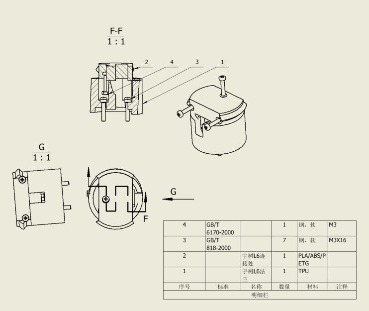
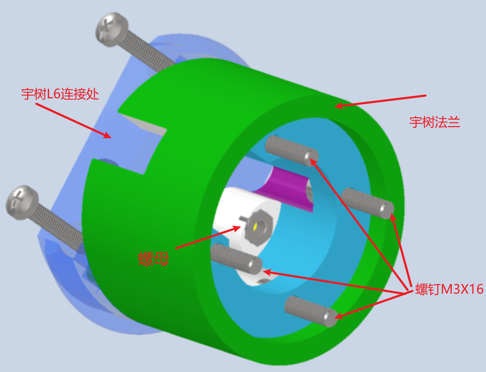

# 灵巧手 L6 转接安装说明

## 1. 总览

本组件用于将 **灵心巧手（LinkerBot）Linker Hand L6** 安装至宇树机器人手臂，由两个 3D 打印转接件和紧固件组成。

## 2. BOM 表

| 项目 | 名称 | 类型 | 数量 |
|:---:|:---|:---:|:---:|
| 1 | 宇树 L6 法兰（3D 打印件） | 自制件 | 1 |
| 2 | 宇树 L6 连接处（3D 打印件） | 自制件 | 1 |
| 3 | 螺钉 GB/T 818 M3×16（十字槽盘头螺钉） | 外购件 | 7 |
| 4 | 螺母 GB/T 6170 M3（六角螺母） | 外购件 | 1 |

## 3. 图一：工程图

## 4. 图二：三维装配图

## 5. 3D 交互模型

`宇树L6连接001.html` 用浏览器打开后可以拖拽旋转、缩放模型，并可切换至爆炸图查看各零件的装配关系。

## 6. 装配步骤

1. 将 M3 螺母放入宇树 L6 法兰对应的槽位中（如图示位置）。
2. 将宇树 L6 法兰与 Linker Hand L6 对齐，用 4 颗 M3×16 螺钉固定。
3. 灵巧手的电源线从法兰的凹槽处引出。
4. 将宇树 L6 连接处与法兰对齐，用剩余 3 颗 M3×16 螺钉固定。

## 7. 注意事项

- 打印件如有支撑或毛刺，先清理再装配。
- 螺母放入槽位后注意不要偏位。
