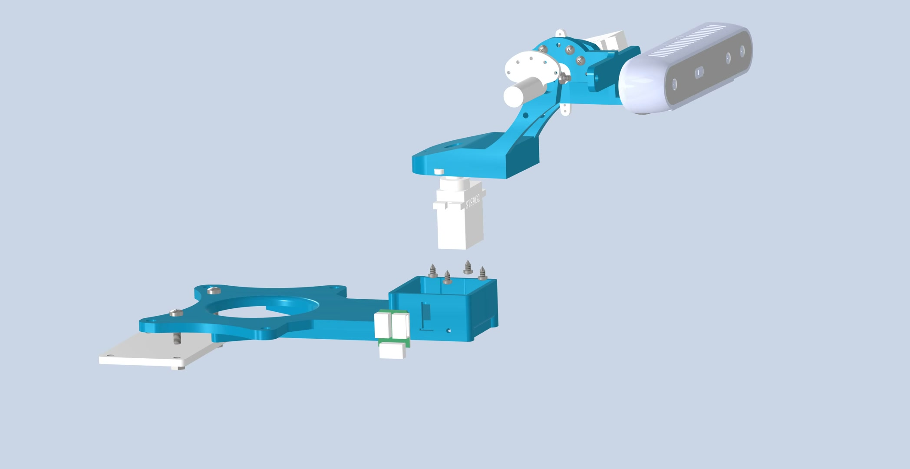
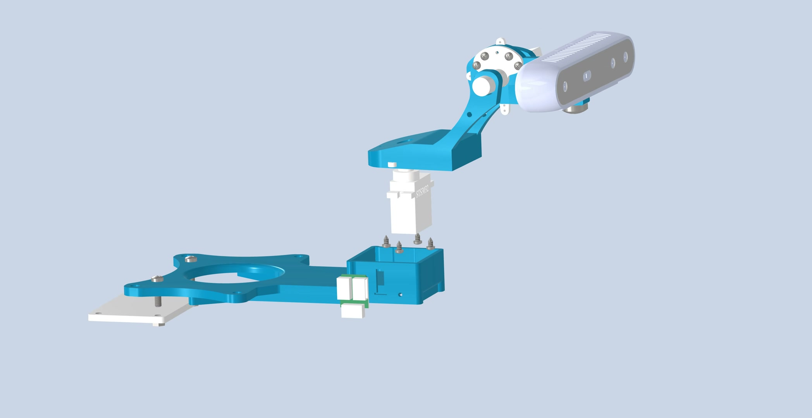
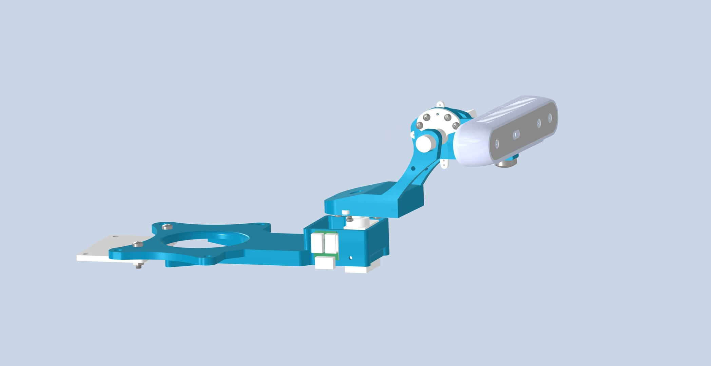

# 主动视觉平台简明机械安装教程

> 文档版本：2026-07-28
> 本教程只包含零部件安装、紧固和机械检查。

- [零部件清单（BOM）](../bom/avp_model_BOM.xlsx)
- [总装 STEP 模型](../models/avp_model.stp)
- [总装 STL 模型](../models/avp_model.stl)

## 1. 安装前确认

准备以下主要部件：

| 类别 | 部件 |
|---|---|
| 3D 打印件 | 001 主安装座、002 俯仰支架、004 摄像头支撑件、零件1 |
| 其他部件 | 2 × STS3032、2 × 舵脚、转接板、URT-2、D415 |
| 紧固件 | ST2.2 × 4.5 若干、M6 × 8 1 颗、M3 × 6 2 颗、M3 × 12 2 颗、M3 薄螺母 2 个 |

清除打印件上的支撑残留和孔内毛刺，将 M3 × 6、M3 × 12、M6 × 8 分开放置，避免混用。

## 2. 安装下部组件

1. 将 1 个 STS3032 放入 001 的安装槽，输出轴竖直朝上。
2. 对正舵机法兰孔，使用 ST2.2 × 4.5 自攻螺钉固定；先轻旋定位，再对角锁紧。
3. 将 1 个舵脚套到水平舵机输出轴上，暂不锁死。
4. 将转接板放到 001 侧面的预留位置，接口朝外，使用 ST2.2 × 4.5 自攻螺钉固定。

## 3. 安装上部组件

1. 按总装模型方向摆放 002 和 004，将另一个 STS3032 装入安装位，输出轴保持水平。
2. 使用 ST2.2 × 4.5 自攻螺钉固定舵机。
3. 将舵脚装到舵机输出轴上；从另一侧装入零件1，使舵脚中心、输出轴和零件1保持同轴。
4. 将 D415 镜头面朝外放入支架，先从底部装入 1 颗 M6 × 8，再使用 2 颗 M3 × 6 固定摄像头支架与相邻连接件。
5. 将 URT-2 对正预留孔位，使用 2 颗 M3 × 12 和 2 个 M3 薄螺母固定。

## 4. 对接上下组件

1. 将上部组件放到下部组件正上方，使 D415 镜头面朝整机正前方。
2. 对正水平舵机输出轴、舵脚中心和上部组件底面孔。

3. 保持上部组件水平，缓慢垂直下移。

4. 确认上下安装面完全贴合后，锁紧水平轴和俯仰轴舵脚的自带紧固件。

## 5. 完成检查

- [ ] 001、002、004 和零件1方向与总装模型一致；
- [ ] 两个舵机与安装槽完全贴合；
- [ ] 两个舵脚均已贴合并锁紧；
- [ ] D415 居中且镜头面无遮挡；
- [ ] 转接板和 URT-2 安装平整、无晃动；
- [ ] 打印件无裂纹，所有螺钉规格正确；
- [ ] 轻轻活动水平轴和俯仰轴时无碰撞、刮擦或卡滞。

> 自攻螺钉锁到螺钉头贴合即可，避免拧裂打印件。不得用 M3 × 12 替代 M3 × 6，也不得使用更长的 M6 螺钉固定 D415。若孔位与图片不同，以配套的最新版 STEP 模型和 BOM 为准。
