# 主动视觉平台（2-DOF）安装说明

> 文档版本：2026-07-19  
> 适用对象：Intel RealSense D415 + 2 × STS3032 主动视觉平台

## 配套工程文件

- [最新版 BOM：avp_model_BOM.xlsx](../bom/avp_model_BOM.xlsx)
- [总装交互模型：avp_model.html](../models/avp_model.html)
- [总装 STEP 模型：avp_model.stp](../models/avp_model.stp)
- [总装 STL 模型：avp_model.stl](../models/avp_model.stl)

其中 `avp_model.html` 可在浏览器中交互查看总装模型，`avp_model.stp` 用于三维设计软件中的装配检查与后续修改，`avp_model.stl` 用于快速预览总装外形。

## 1. 产品概述

本组件用于将 **Intel RealSense D415 深度摄像头**安装到双轴 STS3032 舵机机构上，实现：

- **Yaw（水平旋转）**：由下部舵机驱动上部云台绕竖直轴旋转；
- **Pitch（垂直俯仰）**：由上部舵机驱动摄像头绕水平轴俯仰；
- 实际活动范围应通过软件限位设置，并以线缆不受拉扯、结构不发生碰撞为准。


图中可将整机分成两个子组件：

1. **下部水平旋转组件**：001 主安装座、水平舵机、转接板和相关紧固件；
2. **上部摄像头俯仰组件**：002/004 打印件、垂直舵机、舵脚、零件1和 D415 摄像头。

## 2. 最新 BOM 与部件识别

| 序号 | 部件图片 | 名称 | 类型 | 数量 | 备注 |
|:---:|:---:|---|:---:|:---:|---|
| 1 | 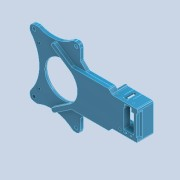 | `001_2dof_head - G1_head_mount.stl` | 普通件 | 1 | PLA 3D 打印件 |
| 2 | 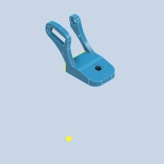 | `002_2dof_head - G1_head_mount.stl` | 普通件 | 1 | PLA 3D 打印件 |
| 3 | 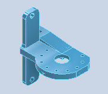 | `004_3dof_head - G1_head_mount.stl` | 普通件 | 1 | PLA 3D 打印件 |
| 4 | 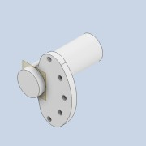 | `零件1` | 普通件 | 1 | PLA 3D 打印件；俯仰轴侧定位/支撑件 |
| 5 | 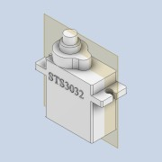 | 舵机 STS3032 | 外购件 | 2 | 分别用于水平旋转和垂直俯仰 |
| 6 | 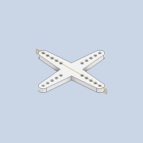 | 舵机 STS3032_舵脚 | 外购件 | 2 | STS3032 自带 |
| 7 | 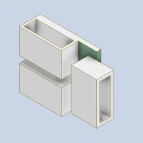 | 转接板 | 外购件 | 1 | STS3032 自带 |
| 8 | 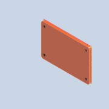 | URT-2 | 外购件 | 1 | 飞特舵机 URT-2 调试板 |
| 9 | 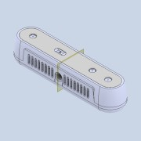 | 英特尔 RealSense 深度摄像头 D415 | 外购件 | 1 | USB 3.0 数据连接 |
| 10 | 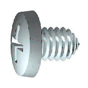 | GB 845-85 ST2.2 × 4.5 - C - H | 外购件 | 若干 | C-H 型十字槽盘头自攻螺钉 |
| 11 | 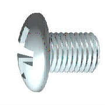 | GB/T 818 M6 × 8 | 外购件 | 1 | H 型十字槽盘头螺钉 |
| 12 |  | GB/T 818 M3 × 12 | 外购件 | 2 | H 型十字槽盘头螺钉 |
| 13 | 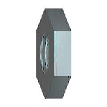 | GB/T 6174 M3 | 外购件 | 2 | 六角薄螺母（无倒角） |
| 14 |  | GB/T 818 M3 × 6 | 外购件 | 2 | H 型十字槽盘头螺钉 |

## 3. 工具与安装前准备

### 3.1 建议工具

- 适配 M3、M6 盘头螺钉的十字螺丝刀；
- 小号十字螺丝刀，用于 ST2.2 自攻螺钉；
- M3 薄螺母对应的小扳手或尖嘴钳；
- 飞特 URT-2 调试板、Micro USB 线；
- D415 USB 3.0 数据线；
- 扎带或软质理线带。

### 3.2 打印件和孔位检查

1. 清除 001、002、004 和零件1上的支撑残留、毛刺及孔内碎屑。
2. 先将螺钉轻轻试入孔位，确认没有堵孔；不要用机螺钉强行攻入未处理的打印孔。
3. 检查舵机能完全贴合安装槽，输出轴与结构件圆孔同轴。
4. 将所有部件按 BOM 排放，M3 × 6、M3 × 12 和 M6 × 8 分开放置，避免混用。

### 3.3 舵机预配置

必须在装上大支架前完成舵机设置：

1. 使用 URT-2 单独连接第一只 STS3032，将其设为 **ID=1（水平旋转）**；
2. 单独连接第二只 STS3032，将其设为 **ID=2（垂直俯仰）**；
3. 两只舵机波特率统一设为 **1000000**；
4. 分别测试通信，并将两只舵机置于中位 **2048**；
5. 断电后再开始机械装配。

> 同一总线上不能存在两个相同 ID。带支架调试会增加夹手和堵转风险。

## 4. 装配步骤

### 4.1 组装下部水平旋转组件

使用部件：001、ID=1 舵机、1 个舵脚、转接板、ST2.2 × 4.5 自攻螺钉。

1. 将 ID=1 舵机装入 001 后部的舵机安装腔，**输出轴竖直朝上**。
2. 调整舵机线的引出方向，使线缆从预留开口自然引出，不被壳体压住。
3. 将舵机法兰孔与 001 的对应孔对正，使用 ST2.2 × 4.5 自攻螺钉逐颗锁紧。
4. 采用对角、分次锁紧方式；螺钉头贴合即可，不要把打印件拧裂。
5. 将转接板放到 001 侧面的预留位置，接口朝外，使用 ST2.2 × 4.5 自攻螺钉按匹配孔位固定。若打印件修订版的孔位不同，以最新版三维模型中的对应孔位为准。
6. 暂时不要把水平舵脚与上部结构完全锁死，待总装归中时再固定。

### 4.2 组装上部摄像头俯仰组件

使用部件：002、004、零件1、ID=2 舵机、1 个舵脚、D415、M6 × 8、2 × M3 × 6、ST2.2 × 4.5 自攻螺钉。

1. 按三维模型方向摆放 002 和 004，使两侧支撑臂形成摄像头的俯仰安装空间。
2. 将 ID=2 舵机放入对应安装位，**输出轴保持水平**，舵机线朝后或朝下引出。
3. 使用 ST2.2 × 4.5 自攻螺钉按匹配孔位固定舵机。
4. 将舵脚装到 ID=2 舵机输出轴上，但先保持可调整状态。
5. 将 `零件1` 安装到俯仰轴另一侧的圆形定位孔。其法兰面应贴合支撑件，圆柱轴应与舵机输出轴同轴，转动时不得卡滞。
6. 将 D415 放到摄像头支撑位置，镜头面朝外、USB 接口朝便于走线的一侧。
7. 使用 1 颗 M6 × 8 从摄像头底部安装孔固定 D415；确认螺钉正确进入摄像头螺纹孔后再拧紧。
8. 再使用 2 颗 M3 × 6 按模型对应孔位固定摄像头支架与相邻连接件，先定位再交替锁紧。
9. 手动小角度摆动俯仰结构，确认摄像头、零件1、舵脚和两侧支撑臂之间没有干涉。

完成后的上部结构可参考下图。舵机、舵脚和零件1应位于同一俯仰轴线上。


### 4.3 安装 URT-2 调试板

使用部件：URT-2、2 × M3 × 12、2 × M3 薄螺母。

1. 将 URT-2 对准结构件上的两个安装孔，USB 接口和舵机接口应便于插拔。
2. 分别穿入 2 颗 M3 × 12 螺钉，并在背面装上 2 个 M3 薄螺母。
3. 两组螺钉交替拧紧，使电路板保持平整；不要让螺钉头或螺母压到电子元件。
4. 保证 URT-2、转接板及线缆不进入上下两轴的运动范围。

### 4.4 对接上下两个子组件

1. 再次确认两只舵机均处于 **2048 中位**，然后断电。
2. 将上部摄像头组件置于下部 001 组件上方，使水平舵机输出轴、舵脚中心和上部底面圆孔同轴。


3. 保持摄像头朝机器人正前方，缓慢垂直下移上部组件；不要斜压舵机输出轴。


4. 确认上下接触面完全贴合，转接位置没有夹住舵机线。
5. 按 STS3032 舵脚的标准安装方式，锁紧舵脚与水平舵机输出轴的中心紧固件；舵脚自带紧固件不另计入本 BOM。
6. 同样确认垂直舵脚与摄像头俯仰结构连接可靠。
7. 轻轻手动检查两轴方向是否正确。未通电时不要强行大角度扳动舵机。

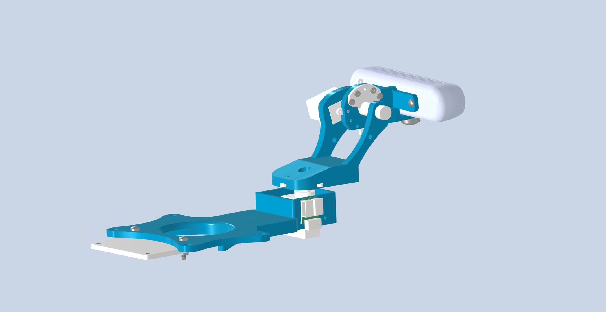

### 4.5 接线与理线

舵机总线推荐按以下顺序连接：

```text
PC ── Micro USB ── URT-2 ── ID=1 水平舵机 ── ID=2 垂直舵机
                           │
                           └── 舵机电源

PC ── USB 3.0 ───────────────────────────── D415
```

1. 将 URT-2/转接板与 ID=1 舵机连接，再由 ID=1 串接至 ID=2。
2. D415 使用 USB 3.0 数据线连接 PC。
3. 在水平轴和俯仰轴附近分别预留活动线长，缓慢转动结构确认线缆不会绷紧、折死或卷入舵脚。
4. 使用软质理线带固定余线，不要把扎带压在数据线插头根部。
5. 本说明沿用原方案的舵机供电配置：**12 V、建议 3 A 以上**。首次通电前必须再次核对所购 STS3032 的铭牌电压与电源极性。

### 4.6 归中与校准

1. 将云台置于无障碍位置，检查紧固件、接线和电源极性。
2. 通电后确认可以分别识别 ID=1 和 ID=2。
3. 在原项目环境中运行校准程序：

```bash
conda activate active_vision
cd windows   # 或 cd linux
python run.py --calibrate
```

4. 舵机回到 2048 中位后，使 D415 镜头面正对机器人正前方。
5. 如机械中位存在偏差，断电后松开相应舵脚，重新对正后再锁紧。
6. 设置安全的软件角度限位，并低速测试水平、俯仰运动。

## 5. 装配完成后的外观验收

### 5.1 前后视图

| 前视参考 | 后视参考 |
|:---:|:---:|
| 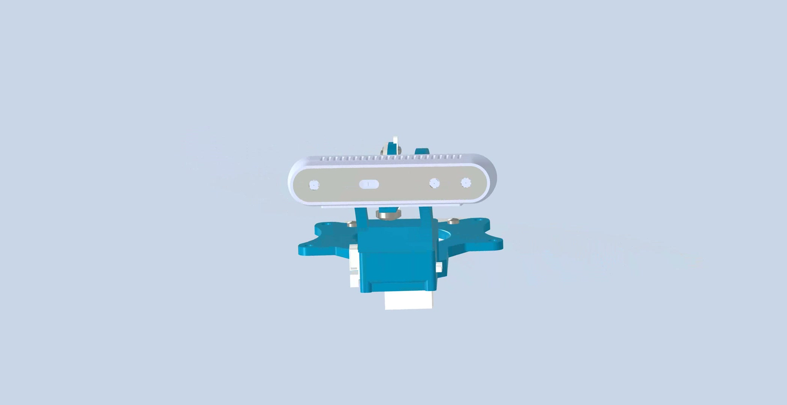 |  |

### 5.2 左右侧视图

| 左侧参考 | 右侧参考 |
|:---:|:---:|
|  |  |

### 5.3 最终透视图

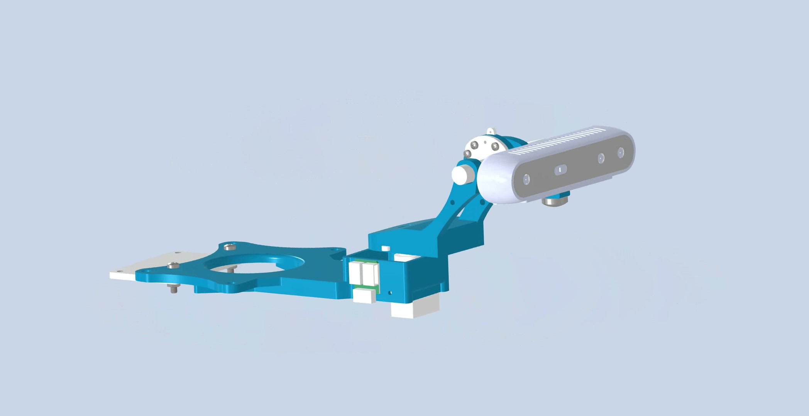

验收时逐项确认：

- [ ] D415 镜头面无结构遮挡；
- [ ] 水平轴和俯仰轴的机械中位正确；
- [ ] 001、002、004 和零件1安装方向与模型一致；
- [ ] 所有舵机法兰螺钉已锁紧，打印件无裂纹；
- [ ] M6 × 8、M3 × 12、M3 × 6 未混用；
- [ ] URT-2 与转接板固定牢固，无短路风险；
- [ ] 全行程内线缆无拉扯、摩擦和夹线；
- [ ] 两只舵机 ID 不重复，波特率一致；
- [ ] 低速运动无卡滞、异常噪声或碰撞。

## 6. 常见问题与处理

| 现象 | 可能原因 | 处理方法 |
|---|---|---|
| 两只舵机不能分别控制 | ID 重复或波特率不一致 | 拆开总线，使用 URT-2 逐只检查 ID 和波特率 |
| 通电后结构突然撞限位 | 舵脚未在 2048 中位装配，或软件方向/限位错误 | 立即断电，重新归中舵机并检查方向和限位 |
| 水平旋转时线缆被拉紧 | 舵机线或 USB 线未预留活动长度 | 重新理线，分别为水平轴和俯仰轴预留线环 |
| 摄像头俯仰有明显晃动 | M6 × 8、舵脚或零件1未正确贴合 | 断电后检查同轴度和紧固状态，逐项复紧 |
| 自攻螺钉空转 | 打印孔过大或已滑牙 | 不要继续强拧；修复孔位或更换打印件后再装 |
| 舵机无力、通信反复掉线 | 电源电流不足、压降或极性/接触问题 | 检查电源规格、接头、线径和 URT-2 连接 |

## 7. 重要安全提示

- 舵机参数设置应在大支架装配前完成，调试时手指远离舵脚和转轴。
- 调整舵脚、拆装机构、处理卡滞或重新理线前必须断电。
- 3D 打印件上的自攻螺钉只需锁到贴合，过度拧紧会导致分层或开裂。
- 首次运动测试应使用低速、小角度，并准备随时断电。
- D415 USB 线与舵机电源线尽量分开走线，避免接头受力和信号不稳定。
- 若实物孔位与文档图片不同，优先核对同批次 [avp_model.html](../models/avp_model.html)、[avp_model.stp](../models/avp_model.stp) 和 [avp_model_BOM.xlsx](../bom/avp_model_BOM.xlsx)，不要强行装配。
