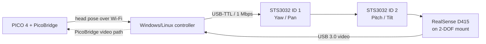

<!-- licensing-notice -->
> [!NOTE]
> Project-owned assets use the root MIT license; bundled third-party SDKs retain their own licenses. See [THIRD_PARTY_NOTICES.md](THIRD_PARTY_NOTICES.md).

# Robot Platform

[](https://github.com/zc-xzc/robot_platform/actions/workflows/python-app.yml)
[](https://github.com/zc-xzc/robot_platform/actions/workflows/pylint.yml)

**“Head moves, view moves” — immersive remote vision for humanoid robots.**

Robot Platform combines PICO 4 head tracking, a two-axis STS3032 camera gimbal, Intel RealSense D415 video, printable mechanical parts, and simulation assets for humanoid-robot development.

本仓库整合了 PICO 4 头部追踪、双轴 STS3032 主动视觉云台、Intel RealSense D415 摄像头、3D 打印结构件，以及适用于人形机器人开发的仿真模型。

> [!IMPORTANT]
> **All active-vision head mechanisms in this repository are 2-DOF:** yaw/pan and pitch/tilt. Some archived STL filenames contain `3dof` because of historical, non-standard naming; those files are **not** three-degree-of-freedom mechanisms.
>
> **本仓库中的主动视觉头部机构全部是两自由度：**水平旋转（Yaw/Pan）+ 垂直俯仰（Pitch/Tilt）。部分历史 STL 文件名含有 `3dof`，这只是早期命名不规范，**不代表三自由度机构**。

## Repository overview / 仓库概览

| Module | What it contains | Start here |
| --- | --- | --- |
| [`active_vision_dist/`](active_vision_dist/) | Windows/Linux control software, calibration, servo tuning, diagnostics, and the bundled Feetech servo SDK | [English guide](active_vision_dist/README.md) · [中文说明](active_vision_dist/README_CN.md) |
| [`3d_print_parts/`](3d_print_parts/) | 2-DOF gimbal packages, wheeled-robot/OpenArm STL archive, and Unitree L6 adapters | [Latest AVP package](3d_print_parts/avp_model/README.md) · [Compact assembly guide](3d_print_parts/Active_Vision_platform_001/installation_guide.md) · [STL index](3d_print_parts/Wheeled_robot_openarm/README.md) |
| [`updf_Robotic/`](updf_Robotic/) | URDF, MuJoCo XML, meshes, ROS packages, and Gazebo launch files | [Model inventory](#simulation-models--仿真模型) |

The repository contains research and development assets at different levels of maturity. Check the relevant subdirectory documentation before printing, machining, or integrating a model.

## Active vision system / 主动视觉系统



The controller receives PICO head-pose data, computes body-relative yaw and pitch, applies a PD controller, and maps the result to two serial-bus servos. The D415 follows the operator’s view and its video frames are sent through PicoBridge.

Core capabilities:

- PICO quaternion/head-pose input at approximately 50 Hz
- Body-relative orientation using the headset/body tracking data
- 2-DOF yaw/pitch servo control with configurable limits, offsets, direction, acceleration, and PD gains
- First-run limit calibration and one-time servo PID/dead-zone tuning
- D415 capture and video-frame forwarding
- Head-tracking, camera-only, logging, and no-camera diagnostic modes
- Windows and Linux entry points with the same command-line interface

### Hardware

| Component | Recommended model | Quantity | Default/configuration |
| --- | --- | ---: | --- |
| VR headset | PICO 4 | 1 | Runs the PicoBridge APK; headset and PC must share a network |
| Serial-bus servo | Feetech STS3032 12 V (`ST-3032-C062`) | 2 | ID 1 = yaw, ID 2 = pitch; baud rate `1000000` |
| USB-to-TTL adapter | Feetech URT-1 or URT-2 | 1 | The full mechanical design mounts URT-2; URT-1 may need a different fixture |
| Depth camera | Intel RealSense D415 | 1 | USB 3.0 connection to the PC |
| Servo power supply | Regulated 12 V, at least 3 A | 1 | Size for two servos and transient/stall current |
| Host computer | Windows or Linux PC | 1 | Python 3.10, Wi-Fi, USB ports |

### Software prerequisites

- Python 3.10 is the tested CI version.
- Python packages are listed in [`active_vision_dist/requirements.txt`](active_vision_dist/requirements.txt).
- The PicoBridge Python wheel and PICO APK are external prerequisites and are **not stored in this repository**. Obtain them from the [PicoBridge project](https://github.com/OpenRobotTech/PicoBridge) or your project release package.
- Install Intel RealSense runtime/USB support appropriate for the host system if `pyrealsense2` cannot detect the D415.

## Quick start / 快速开始

### 1. Create the environment

```bash
git clone https://github.com/zc-xzc/robot_platform.git
cd robot_platform/active_vision_dist

conda create -n active_vision python=3.10 -y
conda activate active_vision
pip install -r requirements.txt

# Example only: install the PicoBridge wheel obtained separately.
pip install /path/to/pico_bridge-0.2.1-py3-none-any.whl
```

Install the corresponding PicoBridge APK on PICO 4, then place the headset and PC on the same Wi-Fi network.

### 2. Configure the servos before assembly

Use the Feetech configuration tool to configure each servo separately:

| Axis | Servo ID | Baud rate |
| --- | ---: | ---: |
| Yaw / horizontal | 1 | 1000000 |
| Pitch / vertical | 2 | 1000000 |

Do not connect two servos with the same ID to the same bus. Complete this step before installing the brackets so the mechanism cannot trap fingers during configuration.

### 3. Calibrate and run

Starting from `active_vision_dist/`, enter the directory for the host operating system.

```bash
# Windows
cd windows
python run.py --port COM6 --calibrate
python run.py --port COM6 --tune-servo
python run.py --port COM6
```

```bash
# Linux
cd linux
python run.py --port /dev/ttyUSB0 --calibrate
python run.py --port /dev/ttyUSB0 --tune-servo
python run.py --port /dev/ttyUSB0
```

Calibration creates `gimbal_config.json`. Recalibrate whenever the gimbal is disassembled or its mechanical center changes.

Useful modes:

| Command | Purpose |
| --- | --- |
| `python run.py --test-head` | Test PICO tracking without running the full system |
| `python run.py --test-camera` | Test D415 capture/video forwarding |
| `python run.py --no-camera` | Run tracking and gimbal control without the D415 |
| `python run.py --no-body` | Disable body-relative tracking |
| `python run.py --log data.csv` | Run while recording tracking/control data |
| `python run.py --no-inv-yaw` | Reverse the configured yaw direction |
| `python run.py --no-inv-pitch` | Reverse the configured pitch direction |
| `python autotune.py` | Search servo-control parameters; run from `active_vision_dist/` |

For control parameters, data columns, troubleshooting, and the complete command reference, see the [English documentation](active_vision_dist/README.md), [中文说明](active_vision_dist/README_CN.md), [technical reference](active_vision_dist/TECHNICAL_REFERENCE.md), or [中文技术参考](active_vision_dist/TECHNICAL_REFERENCE_CN.md).

## 3D-printable parts / 3D 打印结构件

| Asset set | Formats and contents | Status / notes |
| --- | --- | --- |
| [`avp_model`](3d_print_parts/avp_model/) | Latest spreadsheet BOM, illustrated full/mechanical installation guides, editable STEP assembly, assembly STL, and printable-part STL/STEP exports | Primary documented 2-DOF D415 + 2 × STS3032 assembly package |
| [`Active_Vision_platform_001`](3d_print_parts/Active_Vision_platform_001/) | STEP assembly, spreadsheet BOM, and compact installation guide | Alternate 2-DOF D415 gimbal package; nominal yaw ±90°, pitch ±60° |
| [`Wheeled_robot_openarm`](3d_print_parts/Wheeled_robot_openarm/) | 39 indexed STL files covering active-vision mounts and hand/L6 connectors | Development archive with dated variants, tests, old designs, and explicitly abandoned concepts; no single production-ready “final” file is declared |
| [`unitree_l6_joint`](3d_print_parts/unitree_l6_joint/) | STEP and STL adapter model | Unitree L6 integration adapter |

Before printing from `Wheeled_robot_openarm`, read its [file index and model notes](3d_print_parts/Wheeled_robot_openarm/README.md). Exact duplicate files have already been removed, but similarly named files may be intentional geometric revisions. In particular, `3dof` in a filename is only a historical label—the active-vision geometry remains 2-DOF.

STL files do not encode physical units. Confirm units, scale, hole diameters, print orientation, clearances, and robot-specific mounting dimensions in CAD/slicer software before manufacturing.

Self-contained CAD-generated HTML viewers are intentionally not distributed. Use the neutral STEP/STP or STL exports for inspection and downstream work.

## Simulation models / 仿真模型

| Directory | Model | Formats / intended use |
| --- | --- | --- |
| [`avp_model`](updf_Robotic/avp_model/) | Latest AVP geometry/reference assembly | Static URDF/ROS package, static MuJoCo XML viewer, STL/OBJ meshes, and RViz/Gazebo launch files; the current URDF joints are fixed and the MJCF has no actuated joints |
| [`Active_Vision_Platform_001`](updf_Robotic/Active_Vision_Platform_001/) | Standalone 2-DOF active-vision platform | URDF, MuJoCo XML, STL/OBJ meshes, ROS package metadata, RViz/Gazebo launch files |
| [`G1_O6_combined_001`](updf_Robotic/G1_O6_combined_001/) | Unitree G1 + O6 hands, with and without the 2-DOF active-vision platform | MuJoCo XML (`g1_avp_o6.xml`, `g1_o6.xml`) and simulation meshes; the AVP-equipped model contains pan and tilt hinge joints |
| [`unitree_l6_link_001`](updf_Robotic/unitree_l6_link_001/) | Unitree L6 link/adapter | URDF, STL mesh, ROS package metadata, RViz/Gazebo launch files |

There are currently **no standalone SDF model files** in the repository. Gazebo support is provided through the ROS URDF packages and launch files; MuJoCo models use XML/MJCF.

The physical `avp_model` assembly is a 2-DOF yaw/pitch mechanism, but its standalone simulation files currently describe a fixed/static reference assembly. Use `Active_Vision_Platform_001` or the AVP section of `G1_O6_combined_001` when movable pan/tilt joints are required, or update the fixed joints before control simulation.

The directory name `updf_Robotic` is retained for repository compatibility even though the model format is URDF.

## Repository structure

```text
robot_platform/
├── .github/workflows/                 # CI: Flake8/compile checks and Pylint errors
├── active_vision_dist/                # Active-vision control software
│   ├── windows/                       # Windows run, calibration, diagnostics
│   ├── linux/                         # Linux run and calibration
│   ├── scservo_sdk/                   # Bundled Feetech serial-servo SDK
│   ├── autotune.py                    # Optional control-parameter search
│   ├── requirements.txt
│   ├── README.md / README_CN.md
│   └── TECHNICAL_REFERENCE.md / TECHNICAL_REFERENCE_CN.md
├── 3d_print_parts/
│   ├── avp_model/                     # Latest illustrated AVP package and STP assembly
│   ├── Active_Vision_platform_001/    # Alternate gimbal assembly, BOM, guide
│   ├── Wheeled_robot_openarm/         # Indexed development STL archive
│   └── unitree_l6_joint/              # L6 STEP/STL adapter
└── updf_Robotic/
    ├── avp_model/                     # Latest static AVP geometry/reference model
    ├── Active_Vision_Platform_001/    # Actuated standalone URDF + MuJoCo model
    ├── G1_O6_combined_001/            # Combined G1/O6 MuJoCo models
    └── unitree_l6_link_001/           # L6 URDF/ROS package
```

## Validation and known limitations / 验证与限制

- GitHub Actions checks Python syntax, undefined names, compilation, and Pylint fatal/error-level findings on Python 3.10.
- CI does not have the physical PICO headset, servos, USB adapter, or D415, so it cannot validate motion direction, cable routing, real-time latency, USB enumeration, or mechanical fit.
- The wheeled-robot/OpenArm directory is an engineering archive, not a curated release of final production parts. Preserve dated and deprecated paths when comparing design history.
- The standalone `updf_Robotic/avp_model` files are currently static reference geometry. A physical two-axis mechanism does not automatically mean every exported URDF/MJCF encodes two movable joints.
- The STL inventory scan found no structurally unreadable files. One L6 flange mesh is documented as containing a small number of degenerate triangles; repair/check it in CAD or slicer software before production use. See the [STL index](3d_print_parts/Wheeled_robot_openarm/README.md) for details.
- Robot model inertial values, joint limits, collision geometry, and reference frames should be verified against the target hardware before control or safety-critical simulation.

## Safety

- Keep hands, cables, and tools outside the mechanism’s sweep during power-on, calibration, and parameter tuning.
- Configure servo IDs and baud rate before installing the brackets. Provide an accessible power cutoff during first motion tests.
- Use a regulated 12 V supply rated for the two servos; insufficient current can cause resets, weak torque, or communication failures.
- Leave enough cable slack for the full yaw/pitch range while preventing cables from entering joints.
- Begin testing with conservative limits and low-risk motion. Do not treat the example settings or simulation models as safety certification.

## Contributing

Issues and pull requests are welcome. For software problems, include the operating system, Python version, adapter/port, servo IDs, command used, and relevant log output. For mechanical changes, identify the source file, robot/camera variant, units, revision purpose, and whether the part has been physically test-fitted.

Please keep active-vision terminology consistent: use **2-DOF yaw/pitch** even when discussing a legacy file whose name contains `3dof`.

## License

This project is distributed under the [MIT License](LICENSE).
